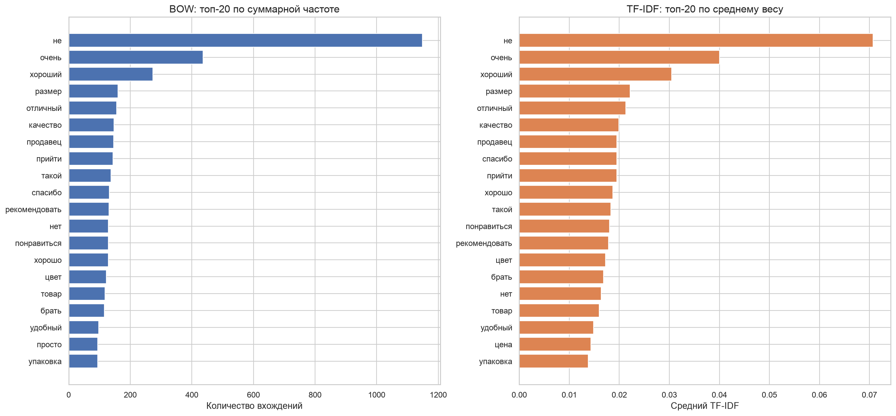
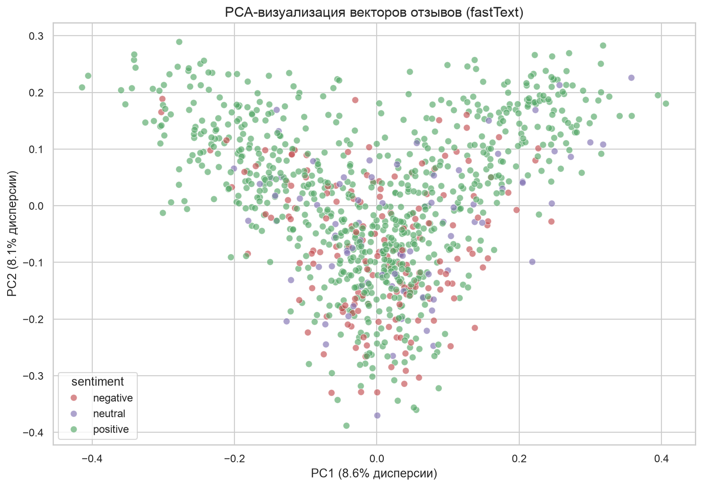

# Анализ тональности отзывов маркетплейса

Проект по NLP, вариант 4. Выполнены задания за недели 1–6 на корпусе из 1 000 русскоязычных отзывов Wildberries.

## Выполненные этапы

1. Загрузка корпуса и первичная статистика.
2. Очистка, токенизация, стоп-слова и обработка слитного текста.
3. Лемматизация spaCy, морфоанализ и сравнение со SnowballStemmer.
4. Bag-of-Words и TF-IDF, топ-слова, графики и облака слов.
5. Обучение Word2Vec, GloVe и fastText, ближайшие слова и арифметика векторов.
6. Классификация тональности на усреднённых векторах и PCA-визуализация.

## Запуск в VS Code

```bash
python3 -m venv .venv
source .venv/bin/activate
python -m pip install --upgrade pip
pip install -r requirements_weeks_1_6.txt
python main.py
```

Все таблицы и графики создаются в `results/`, обученные модели сохраняются в `models/`.

## Результаты

- Word2Vec, GloVe и fastText обучены на собственном лемматизированном корпусе.
- Размерность векторов: 50.
- Лучший семантический разрыв на контрольных парах показал GloVe: 0,3853.
- Лучший классификатор тональности использует fastText.
- Accuracy: 0,6600.
- Balanced accuracy: 0,5266.
- Macro-F1: 0,4871.





## Данные

Источник: [WB Review Dataset](https://huggingface.co/datasets/Hplss/wb-review-dataset), лицензия CC BY-NC-SA 4.0. Оценки 1–2 преобразованы в `negative`, оценка 3 — в `neutral`, оценки 4–5 — в `positive`.
